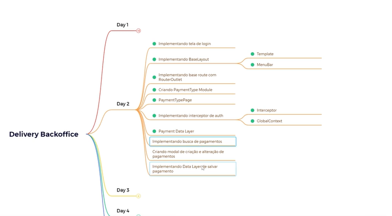

# Delivery backoffice_dw10

# Projeto
- Projeto de estudo de Flutter web utilizando Modular e Mobx, frontend de gerencimento administrativo de aplicação de gerencia de pedidos.
- Segurança com auth utilizando token para realizar a validação de acesso.

# Aula 2
- Criação de segunda aula

</img>

## Backend utilizado 
- Servidor RESTful desenvolvido pela academia do flutter para simular requisições e respostas baseados em json.
- <a>https://pub.dev/packages/json_rest_server</a>

## Dependencia
- Como é utilizado o MobX, será necessário a utilização do build_runner para gerar código necessário. Podemos executar o comando a seguir deixando o mesmo executando e escutando as modificações para que seja gerado o código quando necessário. <code>dart run build_runner watch -d</code>

